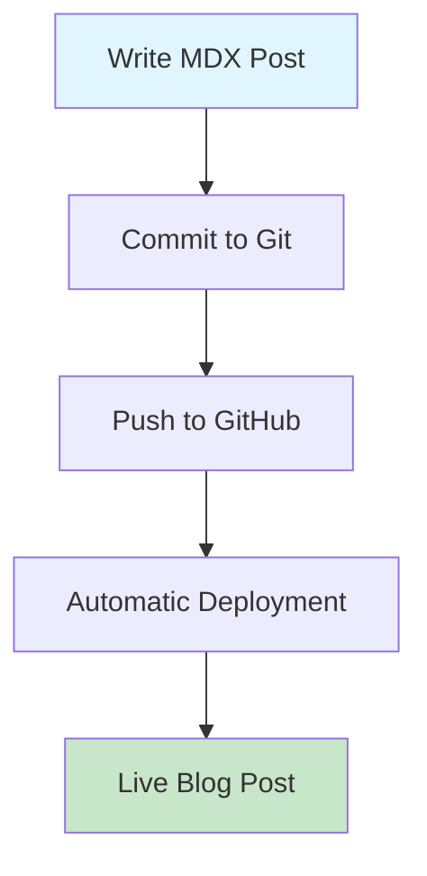

# Mastering Markdown and MDX: Tips, Tricks, and Advanced Features

Markdown has revolutionized how we write content for the web. With MDX, we can now combine the simplicity of Markdown with the power of React components. Let's explore everything from basic syntax to advanced techniques.

## Basic Markdown Syntax

### Headers

```markdown
# H1 Header

## H2 Header

### H3 Header

#### H4 Header

##### H5 Header

###### H6 Header
```

### Text Formatting

You can make text **bold**, _italic_, or **_both_**. You can also ~~strike through~~ text or make it `inline code`.

> This is a blockquote. Great for highlighting important information or quotes from other sources.

### Lists

**Unordered List:**

- First item
- Second item
  - Nested item
  - Another nested item
- Third item

**Ordered List:**

1. First item
2. Second item
   1. Nested numbered item
   2. Another nested item
3. Third item

**Task List:**

- [x] Completed task
- [ ] Incomplete task
- [x] Another completed task
- [ ] Yet another incomplete task

## Advanced Markdown Features

### Tables

Here's a comparison of different blogging platforms:

| Platform     | Database Required | Hosting Cost  | Learning Curve | Flexibility |
| ------------ | ----------------- | ------------- | -------------- | ----------- |
| WordPress    | ✅ Yes            | $10-50/month  | Medium         | High        |
| Ghost        | ✅ Yes            | $9-79/month   | Medium         | Medium      |
| Medium       | ❌ No             | Free/$5/month | Easy           | Low         |
| **MDX Blog** | ❌ No             | Free          | Easy           | Very High   |

### Code Blocks

**JavaScript Example:**

```javascript
// Function to debounce API calls
function debounce(func, wait) {
  let timeout;
  return function executedFunction(...args) {
    const later = () => {
      clearTimeout(timeout);
      func(...args);
    };
    clearTimeout(timeout);
    timeout = setTimeout(later, wait);
  };
}

// Usage
const debouncedSearch = debounce((query) => {
  console.log(`Searching for: ${query}`);
}, 300);
```

**TypeScript with Syntax Highlighting:**

```typescript
interface BlogPost {
  id: string;
  title: string;
  content: string;
  publishedAt: Date;
  tags: string[];
  author: {
    name: string;
    email: string;
  };
}

async function fetchBlogPosts(): Promise<BlogPost[]> {
  const response = await fetch("/api/posts");

  if (!response.ok) {
    throw new Error(`HTTP ${response.status}: ${response.statusText}`);
  }

  return response.json();
}
```

**CSS Example:**

```css
/* Modern CSS Grid Layout */
.blog-grid {
  display: grid;
  grid-template-columns: repeat(auto-fit, minmax(300px, 1fr));
  gap: 2rem;
  padding: 2rem;
}

.blog-card {
  background: white;
  border-radius: 8px;
  box-shadow: 0 4px 6px rgba(0, 0, 0, 0.1);
  overflow: hidden;
  transition: transform 0.2s ease;
}

.blog-card:hover {
  transform: translateY(-4px);
}
```

**Bash/Terminal Commands:**

```bash
# Clone the repository
git clone https://github.com/muzaffar640/db-free-blog-portfolio.git

# Navigate to project directory
cd db-free-blog-portfolio

# Install dependencies
npm install

# Start development server
npm run dev

# Build for production
npm run build
```

### Links and References

- [External link to MDX documentation](https://mdxjs.com/)
- [GitHub repository](https://github.com/muzaffar640/db-free-blog-portfolio)
- Internal link to another post: [Getting Started with Next.js](/blog/getting-started-with-nextjs)

You can also use reference-style links:

I love using [Next.js][nextjs] and [React][react] for building modern web applications.

[nextjs]: https://nextjs.org/
[react]: https://reactjs.org/

## MDX-Specific Features

### Inline JSX

MDX allows you to use JSX directly in your Markdown:

<div
  style={{
    background: "linear-gradient(135deg, #667eea 0%, #764ba2 100%)",
    color: "white",
    padding: "2rem",
    borderRadius: "8px",
    textAlign: "center",
    margin: "2rem 0",
  }}
>
  <h3 style={{ margin: 0, marginBottom: "1rem" }}>This is JSX in Markdown!</h3>
  <p style={{ margin: 0 }}>
    You can use any valid JSX here, including styling and interactivity.
  </p>
</div>

### Interactive Components

Here's a simple interactive counter component:

<div
  style={{
    border: "2px solid #e2e8f0",
    borderRadius: "8px",
    padding: "1.5rem",
    margin: "1rem 0",
    textAlign: "center",
    background: "#f8fafc",
  }}
>
  <p>
    <strong>Interactive Counter Example</strong>
  </p>
  <p style={{ color: "#64748b", fontSize: "0.9rem" }}>
    (This would be a real React component in your MDX setup)
  </p>
  <div
    style={{
      background: "white",
      padding: "1rem",
      borderRadius: "4px",
      border: "1px solid #e2e8f0",
    }}
  >
    <p>
      Count: <span style={{ fontWeight: "bold", color: "#3b82f6" }}>0</span>
    </p>
    <button
      style={{
        background: "#3b82f6",
        color: "white",
        border: "none",
        padding: "0.5rem 1rem",
        borderRadius: "4px",
        cursor: "pointer",
      }}
    >
      Increment
    </button>
  </div>
</div>

## Content Organization Tips

### 1. Use Meaningful Headers

Structure your content with clear, descriptive headers. This helps with:

- **SEO** - Search engines use headers to understand content structure
- **Accessibility** - Screen readers navigate using headers
- **User Experience** - Readers can quickly scan and find relevant sections

### 2. Break Up Long Paragraphs

Instead of writing walls of text, break content into digestible chunks. Use:

- **Short paragraphs** (2-3 sentences max)
- **Bullet points** for lists of items
- **Code blocks** for technical examples
- **Blockquotes** for important callouts
- **Visual elements** like tables and images

### 3. Add Visual Interest

**Before (boring):**

```
Here's how to install the package: npm install package-name. Then you need to import it in your file: import package from 'package-name'. Finally, use it in your code: package.doSomething().
```

**After (engaging):**

````markdown
## Installation

Install the package via npm:

```bash
npm install package-name
```
````

Import it in your JavaScript file:

```javascript
import package from "package-name";
```

Use it in your application:

```javascript
const result = package.doSomething();
console.log(result);
```

````

## Writing Tips for Technical Content

### 1. Start with the Problem

Always begin by explaining **why** someone would need this information:

❌ **Bad:** "Here's how to use useState in React"

✅ **Good:** "Managing component state in React can be confusing for beginners. Here's how useState makes it simple and predictable."

### 2. Provide Context

Don't assume knowledge. Briefly explain concepts:

```markdown
## Using React Hooks

React Hooks (introduced in React 16.8) allow you to use state and other React features in functional components, eliminating the need for class components in most cases.
````

### 3. Include Complete Examples

Show working code, not just snippets:

```jsx
// Complete component example
import React, { useState, useEffect } from "react";

function UserProfile({ userId }) {
  const [user, setUser] = useState(null);
  const [loading, setLoading] = useState(true);

  useEffect(() => {
    async function fetchUser() {
      try {
        const response = await fetch(`/api/users/${userId}`);
        const userData = await response.json();
        setUser(userData);
      } catch (error) {
        console.error("Failed to fetch user:", error);
      } finally {
        setLoading(false);
      }
    }

    fetchUser();
  }, [userId]);

  if (loading) return <div>Loading...</div>;
  if (!user) return <div>User not found</div>;

  return (
    <div>
      <h1>{user.name}</h1>
      <p>{user.email}</p>
    </div>
  );
}

export default UserProfile;
```

## Best Practices for MDX Blogs

### 1. Consistent Frontmatter

Establish a standard frontmatter structure:

```yaml
---
title: "Your Post Title"
date: "2024-01-12"
author: "Author Name"
coverImage: "/images/post-cover.jpg"
tags: ["tag1", "tag2", "tag3"]
excerpt: "Brief description for SEO and previews"
---
```

### 2. SEO Optimization

- **Use descriptive titles** with target keywords
- **Write compelling excerpts** that encourage clicks
- **Add alt text** to images
- **Use proper heading hierarchy** (H1 → H2 → H3)
- **Include internal links** to other relevant posts

### 3. Performance Considerations

- **Optimize images** before including them
- **Lazy load** non-critical content
- **Minimize inline styles** - use CSS classes instead
- **Keep components lightweight**

## Useful Markdown Extensions

### Math Equations (if supported)

You can include mathematical expressions:

```
Inline math: $E = mc^2$

Block math:
$$
\int_{-\infty}^{\infty} e^{-x^2} dx = \sqrt{\pi}
$$
```

### Footnotes

You can add footnotes to your content[^1] for additional context[^2].

[^1]: This is a footnote with additional information.
[^2]: Footnotes are great for references and side notes.

### Mermaid Diagrams (if supported)



## Conclusion

Mastering Markdown and MDX opens up incredible possibilities for creating engaging, interactive content. The combination of simple syntax and powerful features makes it perfect for technical writing, documentation, and blogging.

### Key Takeaways:

- **Start simple** with basic Markdown syntax
- **Gradually add** MDX features as needed
- **Focus on readability** and user experience
- **Use interactive elements** sparingly but effectively
- **Maintain consistency** in formatting and structure

Whether you're writing technical tutorials, personal reflections, or documentation, these techniques will help you create content that's both informative and engaging.

Happy writing! ✍️

---

_This post demonstrates the full range of Markdown and MDX capabilities available in your blog system, from basic formatting to advanced interactive features._
